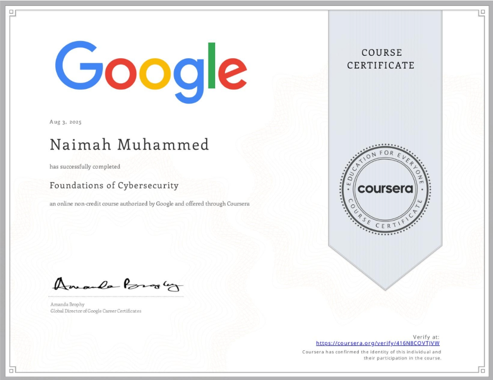

# Naimah Muhammed's  Cybersecurity & CIS Portfolio

Welcome to my professional portfolio.  
I’m a Computer Information Systems major at Howard University with a concentration in Cybersecurity. I’m passionate about using technology to protect people, data, and systems! While ensuring innovation is ethical, inclusive, and impactful.

---

## Professional Statement
I combine technical skills in programming, system analysis, and cybersecurity with entrepreneurial experience and strong communication abilities. My background ranges from founding a small business to conducting security audits and incident response documentation. I aim to help organizations strengthen their security posture while making technology accessible to underserved communities.

---

## Certifications
| Certification | Date Earned | Proof |
|---------------|------------|-------|
| Google Cybersecurity Certificate | Aug 2025 |  |
| CompTIA Security+ (In Progress) | Expected 2025 | - |

---

## Projects

### 1. Security Audit

- Objective: Conducted a mock security audit for a simulated organization.
- Skills Used: Risk assessment, control evaluation, security policy review.
- Outcome: Produced actionable recommendations to improve the organization’s security posture.

### 2. Update a File Through a Python Algorithm

- Objective: Created a Python script to automatically update and manage file data.
- Skills Used: Python scripting, file handling, automation.
- Outcome: Reduced manual work and increased processing accuracy.

### 3. Incident Handler’s Journal (Initial & Final)

- Objective: Documented the lifecycle of a security incident, from identification to resolution.
- Skills Used: Incident triage, evidence documentation, communication.
- Outcome: Produced a comprehensive incident handler’s journal.

### 4. Analyze a Vulnerable System for a Small Business

- Objective: Assessed vulnerabilities in a simulated small business system.
- Skills Used: Vulnerability scanning, report writing, risk prioritization.
- Outcome: Delivered recommendations to mitigate identified weaknesses.

### 5. Use Linux Commands to Manage File Permissions

- Objective: Applied and managed file permissions for different user groups in Linux.
- Skills Used: Linux CLI, chmod, chown.
- Outcome: Improved file access security and reduced unauthorized access risk.

### 6. Apply Filters to SQL Queries

- Objective: Filtered and retrieved specific datasets using SQL commands.
- Skills Used: SQL WHERE, AND, OR operators, query optimization.
- Outcome: Improved data analysis accuracy for security investigations.

### 7. Jollof Appetite – Entrepreneurial Project

- Role: Co-founder & Operations Lead
- Skills Used: Business operations, pricing strategy, delivery logistics, customer service, financial tracking.
- Outcome: Served an inclusive customer base with eggless ice cream recipes, maintained profitability for 3 years.

---

## Resume
[Download My Resume](resume.pdf)

---

## Contact
- Email: jadesola.nm@gmail.com 
- LinkedIn: [linkedin.com/in/yourprofile](https://www.linkedin.com/in/naimah-muhammed-7b576231a/)  
- GitHub: [github.com/yourusername](https://github.com/yourusername)  
